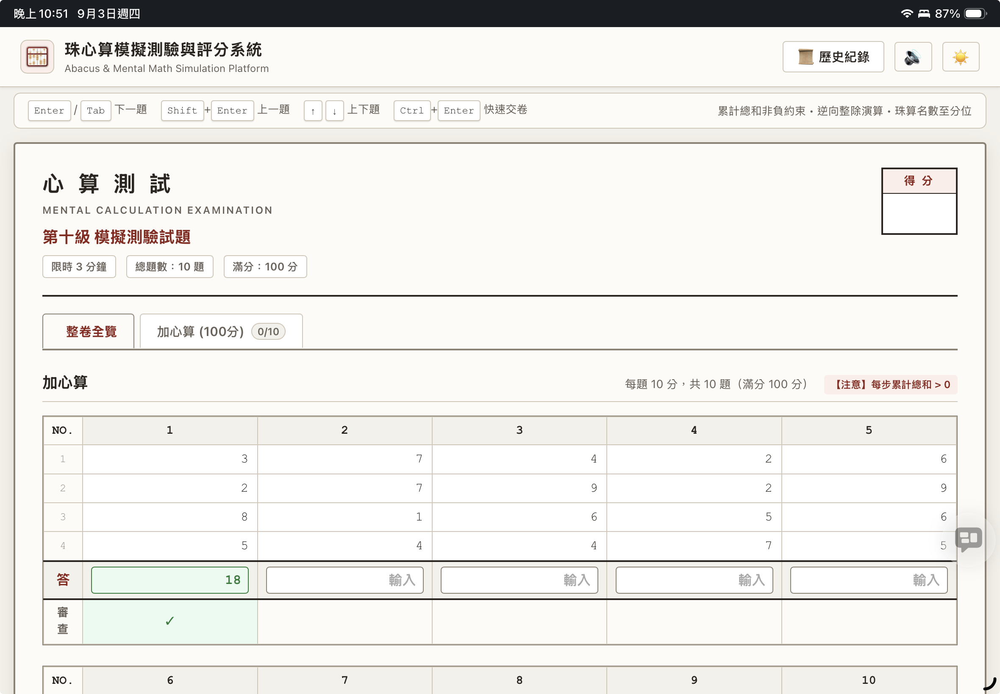

# 🧮 珠算與心算線上模擬測驗與自動評分平台
### Abacus & Mental Calculation Online Simulation & Auto-Grading Platform

[](https://mhbai.github.io/AbacuePractice/)
[](https://mhbai.github.io/AbacuePractice/)
[](LICENSE)

---

## 🌐 線上即時測驗網址 (Live Demo)
👉 **[https://mhbai.github.io/AbacuePractice/](https://mhbai.github.io/AbacuePractice/)**

無需安裝任何套件或伺服器，點擊上方連結即可直接在瀏覽器進行極致流暢的珠算與心算模擬檢定！

---

## 📸 介面預覽 (Interface Preview)



---

## 📖 平台簡介與設計理念

本平台為專為**珠算（Abacus）**與**心算（Mental Math）**學習者、檢定考生與教學機構量身打造的**純前端單頁應用（SPA）**。依據臺灣省商會、中華民國珠算學會及全國珠心算檢定標準規範設計，提供最真實的考試版型、高精度倒數計時、智慧輸入容錯比對與段位證書認定。

---

## ✨ 核心特色與技術亮點

### 1. ⚡ 純前端無伺服器架構 (Zero Backend)
- **即時演算法出題**：所有題型皆在客戶端以隨機數學演算法即時生成，題目百萬變化不重複。
- **本地持久化儲存**：作答設定、主題喜好與完整歷史測驗成績單皆儲存於 `localStorage`，保護使用者隱私。
- **自動記憶上次選擇**：預設進入**準十二級**啟蒙題型，並自動記住上次選擇的測驗項目與級別。

### 2. 🧮 完整支援 14 個檢定級別
- **🧠 心算測驗 (限時 3 分鐘)**：
  - **段位**、**第一級至第十級**、**第十一級**、**第十二級**、**準十二級**。
  - 科目包含：加減心算、乘心算、除心算。
- **🧮 珠算測驗 (限時 10 分鐘)**：
  - **段位**、**第一級至第十級**、**第十一級**、**第十二級**、**準十二級**。
  - 科目包含：加減算（縱列式）、縱橫列計算（$4 \times 5$ 交叉合計矩陣）、乘算、除算。

### 3. 🎯 嚴謹的出題數學邏輯
- **加減算非負約束**：每筆數字隨機生成（含減法），確保「計算過程中的每一步驟累計總和皆嚴格大於 0」。
- **逆向整除生成法**：乘除心算與整數除算預先決定商數與除數相乘得被除數，**100% 保證整除無餘數**。
- **名數與小數四捨五入規範**：
  - 名數（`$`）精準求至**分位**（小數點後第 2 位）。
  - 無名數依級別精確四捨五入（段位/1級至第5位、2級至第4位、3級至第3位、4級以下為整數）。

### 4. ⌨️ 純鍵盤極致作答體驗 (UX)
- 支援數字鍵盤（Numpad）極速盲打作答。
- <kbd>Enter</kbd> / <kbd>Tab</kbd> 自動跳至下一題輸入框並自動全選文字。
- <kbd>Shift</kbd> + <kbd>Enter</kbd> / <kbd>Shift</kbd> + <kbd>Tab</kbd> 返回上一題。
- <kbd>↑</kbd> <kbd>↓</kbd> <kbd>←</kbd> <kbd>→</kbd> 方向鍵在縱橫表格與題目欄間直覺切換。
- <kbd>Ctrl</kbd> + <kbd>Enter</kbd> / <kbd>Cmd</kbd> + <kbd>Enter</kbd> 隨時一鍵立即交卷。

### 5. ⏱️ 高精度計時與 Web Audio 聲效
- 無延遲倒數計時器（時間到自動強制交卷並鎖定輸入）。
- 最後 30 秒視覺預警閃爍，最後 5 秒每秒嗶聲提示。
- 內建 Web Audio API 音訊合成器（開場和弦、節奏音、交卷鐘聲），無需下載外部音檔。

### 6. 📊 雙重批改模式與智慧評分
- **📝 交卷後統一批改（正式測驗模式）**：模擬真實檢定考場，測驗過程中不干擾作答，交卷後統一批改。
- **⚡ 即填即審（自主練習模式）**：每填入一筆答案即刻進行智慧比對，答對亮綠燈顯示「✓」並播放清脆叮聲，答錯亮紅燈顯示「✗」與標準答案，極度適合初學者自主訓練！
- **智慧容錯比對**：自動剔除使用者輸入之 `$` 貨幣符號、千分位逗點 `,`、多餘空白與括號負數。
- **硃筆標記錯題**：如同老師親自用硃筆批改，清晰標註錯誤題目並提供標準解答。
- **段位認定與評級**：支援初段（80分）至十段（260分）標準認定與級別及格判定。
- **A4 列印優化**：支援 <kbd>Ctrl</kbd> + <kbd>P</kbd> 直接將試卷或成績單列印成標準 A4 試題紙。

---

## ⌨️ 鍵盤快捷鍵一覽 (Keyboard Shortcuts)

| 按鍵組合 | 功能說明 |
| :--- | :--- |
| <kbd>Enter</kbd> / <kbd>Tab</kbd> / <kbd>↓</kbd> | 自動跳至下一題輸入框並全選文字 |
| <kbd>Shift</kbd> + <kbd>Enter</kbd> / <kbd>Shift</kbd> + <kbd>Tab</kbd> / <kbd>↑</kbd> | 返回上一題輸入框 |
| <kbd>→</kbd> / <kbd>←</kbd> | 在算式或縱橫矩陣欄位間移動 |
| <kbd>Ctrl</kbd> + <kbd>Enter</kbd> / <kbd>Cmd</kbd> + <kbd>Enter</kbd> | 立即交卷並進行自動評分 |

---

## 📋 測驗級別與出題規範階梯對照表 (依據台灣省商業會官方標準)

本平台嚴格依據**台灣省商業會**頒布之《珠算測試項目及程度、心算測試項目及程度》官方規範設計，完整涵蓋 **16 個檢定級別**：

---

### 🧠 1. 心算測試項目及程度 (Mental Calculation)
> **測試時間**：一張試卷，限制時間 **3 分鐘**  
> **計分標準**：加減心算每題 10 分，乘心算、除心算每題 5 分  
> **合格標準**：級數各項目總分達 **70 分** 以上合格；段位依得分評定（初段 80 分 ~ 十段 200 分）

| 級別 (Level) | 測試項目 | 題數與題型規格 | 考核規範與出題標準 | 總分 / 合格 |
| :--- | :--- | :--- | :--- | :--- |
| **段位 (Degree)** | ① 加減心算<br>② 乘心算<br>③ 除心算 | • 加減：3~5 位名數 10 題 (10口/40字)<br>• 乘心算：實法共 5~6 位無名數 10 題<br>• 除心算：法商共 5~6 位無名數 10 題 | 段位高段挑戰賽<br>初段 80分、二段 90分、三段 100分、四段 110分、五段 120分、六段 130分、七段 140分、八段 160分、九段 180分、十段 200分 | 200 分<br>(初段 80 起評) |
| **第一級 (Class 1)** | ① 加減心算<br>② 乘心算<br>③ 除心算 | • 加減：3~4 位名數 10 題 (10口/35字)<br>• 乘心算：實法共 5 位無名數 10 題<br>• 除心算：法商共 5 位 (含5÷2或5÷3) 10 題 | 熟練 3~4 位名數混合加減與多位數乘除心算 | 200 分<br>(70分合格) |
| **準一級 (Pre-1)** | ① 加減心算<br>② 乘心算<br>③ 除心算 | • 加減：3 位名數 10 題 (10口/30字)<br>• 乘心算：共 5 位 5 題、共 4 位 5 題<br>• 除心算：共 5 位 5 題、共 4 位 5 題 | 純 3 位名數加減與 4~5 位乘除 | 200 分<br>(70分合格) |
| **第二級 (Class 2)** | ① 加減心算<br>② 乘心算<br>③ 除心算 | • 加減：2~3 位名數 10 題 (10口/25字)<br>• 乘心算：實法共 4 位 (2位×2位) 10 題<br>• 除心算：法商共 4 位 (4÷2或3÷2) 10 題 | 2~3 位名數加減與雙位數乘除 | 200 分<br>(70分合格) |
| **準二級 (Pre-2)** | ① 加減心算<br>② 乘心算<br>③ 除心算 | • 加減：2~3 位名數 10 題 (10口/23字)<br>• 乘心算：2位×2位 5題、3位×1位 5題<br>• 除心算：4÷2或3÷2 5題、4÷1或3÷1 5題 | 混合位數乘除入門 | 200 分<br>(70分合格) |
| **第三級 (Class 3)** | ① 加減心算<br>② 乘心算<br>③ 除心算 | • 加減：2 位無名數 10 題 (10口/20字)<br>• 乘心算：實法共 4 位 (3位×1位) 10 題<br>• 除心算：法商共 4 位 (4÷1或3÷1) 10 題 | 2 位無名數整數加減與 3位×1位乘算 | 200 分<br>(70分合格) |
| **第四級 (Class 4)** | ① 加減心算<br>② 乘心算<br>③ 除心算 | • 加減：2 位無名數 10 題 (8口/16字)<br>• 乘心算：2位×1位 5題、3位×1位 5題<br>• 除心算：3÷1或2÷1 5題、4÷1或3÷1 5題 | 2 位數 8 口加減與初階除心算 | 200 分<br>(70分合格) |
| **第五級 (Class 5)** | ① 加減心算<br>② 乘心算<br>③ 除心算 | • 加減：2位4口+1位4口 5題、2位6口 5題<br>• 乘心算：實法共 3 位 (2位×1位) 10 題<br>• 除心算：法商共 3 位 (3÷1或2÷1) 10 題 | 正式導入乘心算與除心算（保證整除無餘數） | 200 分<br>(70分合格) |
| **第六級 (Class 6)** | 加減心算 | • 1 位數 8 口 (總字數8字) 5 題<br>• 2 位數 3 口 + 1 位數 2 口 (總字數8字) 5 題 | 1~2 位數加減心算（無乘除） | 100 分<br>(70分合格) |
| **第七級 (Class 7)** | 加減心算 | • 1 位數 7 口 (總字數7字) 5 題<br>• 2 位數 2 口 + 1 位數 3 口 (總字數7字) 5 題 | 1~2 位數加減心算（無乘除） | 100 分<br>(70分合格) |
| **第八級 (Class 8)** | 加減心算 | • 1 位數 6 口 (總字數6字) 5 題<br>• 2 位數 2 口 + 1 位數 2 口 (總字數6字) 5 題 | 1~2 位數加減心算（無乘除） | 100 分<br>(70分合格) |
| **第九級 (Class 9)** | 加減心算 | 1 位之無名數整數加減法 10 題，一題 5 口，總字數 5 字 | 1 位數 5 口純加減心算（非負約束） | 100 分<br>(70分合格) |
| **第十級 (Class 10)** | 加減心算 | 1 位之無名數整數加減法 10 題，一題 4 口，總字數 4 字 | 1 位數 4 口純加減心算 | 100 分<br>(70分合格) |
| **第十一級 (Class 11)** | 加心算 | 1 位之無名數整數加法 10 題，一題 3 口，總字數 3 字 | 為 **5 組合**及不含混合型之 **10 組合**全部口訣 | 100 分<br>(70分合格) |
| **第十二級 (Class 12)** | 加心算 | 1 位之無名數整數加法 10 題，一題 3 口，總字數 3 字 | 為 **10 組合**不含混合型之**加 6、7、8、9 口訣**，且第 1、2 口為無口訣直加 | 100 分<br>(70分合格) |
| **準十二級 (Pre-12)** | 加心算 | 1 位之無名數整數加法 10 題，一題 3 口，總字數 3 字 | **100% 直覺運珠（純直加，無口訣）**<br>無十進位、無五湊進，總和 $\le 9$ | 100 分<br>(70分合格) |

---

### 🧮 2. 珠算測試項目及程度 (Abacus Calculation)
> **測試時間**：每一測試項目各一張試卷，限制時間 **10 分鐘**  
> **計分標準**：加減算每題 10 分，乘算、除算、縱橫列計算每題 5 分  
> **合格標準**：每一測試項目得分均達 **70 分** 以上方為合格（段位各項 80 ~ 200 分）

| 級別 (Level) | 測試項目 | 題數與題型規格 | 考核規範與四捨五入標準 | 滿分 / 及格標準 |
| :--- | :--- | :--- | :--- | :--- |
| **段位 (Degree)** | ① 乘算 (40題)<br>② 除算 (40題)<br>③ 加減算 (20題) | • 乘算：實法共 11 位名數/無名數帶小數<br>• 除算：法商共 10 位名數/無名數帶小數<br>• 加減：5~10 位名數 15 口 (含補數 2 題) | • 名數求至分位（小數點後 2 位）<br>• 無名數求至小數第 5 位<br>• 初段 80分 ~ 十段 200分 | 乘200/除200/加200<br>(各科80分起評) |
| **第一級 (Class 1)** | ① 乘算 (20題)<br>② 除算 (20題)<br>③ 加減算 (10題)<br>④ 縱橫列 (10題) | • 乘算：實法共 11 位<br>• 除算：法商共 10 位<br>• 加減：9~10 位 10 口 (含補數 1 題)<br>• 縱橫列：$4 \times 5$ 矩陣交叉合計 (9~10位) | • 名數求至分位<br>• 無名數求至小數第 5 位 | 乘100/除100/加100/縱50<br>(各科70分合格) |
| **準一級 (Pre-1)** | ① 乘算 (20題)<br>② 除算 (20題)<br>③ 加減算 (10題)<br>④ 縱橫列 (10題) | • 乘算：實法共 10 位<br>• 除算：法商共 9 位<br>• 加減：8~9 位 10 口 (含補數 1 題)<br>• 縱橫列：$4 \times 5$ 矩陣交叉合計 (8~9位) | • 名數求至分位<br>• 無名數求至小數第 5 位 | 乘100/除100/加100/縱50<br>(各科70分合格) |
| **第二級 (Class 2)** | ① 乘算 (20題)<br>② 除算 (20題)<br>③ 加減算 (10題)<br>④ 縱橫列 (10題) | • 乘算：實法共 9 位<br>• 除算：法商共 8 位<br>• 加減：7~8 位 10 口<br>• 縱橫列：$4 \times 5$ 矩陣交叉合計 (7~8位) | • 名數求至分位<br>• 無名數求至小數第 4 位 | 乘100/除100/加100/縱50<br>(各科70分合格) |
| **準二級 (Pre-2)** | ① 乘算 (20題)<br>② 除算 (20題)<br>③ 加減算 (10題)<br>④ 縱橫列 (10題) | • 乘算：實法共 8 位<br>• 除算：法商共 7 位<br>• 加減：6~7 位 10 口<br>• 縱橫列：$4 \times 5$ 矩陣交叉合計 (6~7位) | • 名數求至分位<br>• 無名數求至小數第 4 位 | 乘100/除100/加100/縱50<br>(各科70分合格) |
| **第三級 (Class 3)** | ① 乘算 (20題)<br>② 除算 (20題)<br>③ 加減算 (10題)<br>④ 縱橫列 (10題) | • 乘算：實法共 7 位<br>• 除算：法商共 6 位<br>• 加減：5~6 位 10 口<br>• 縱橫列：$4 \times 5$ 矩陣交叉合計 (5~6位) | • 名數求至分位<br>• 無名數求至小數第 3 位 | 乘100/除100/加100/縱50<br>(各科70分合格) |
| **第四級 (Class 4)** | ① 乘算 (20題)<br>② 除算 (20題)<br>③ 加減算 (10題)<br>④ 縱橫列 (10題) | • 乘算：實法共 7 位無名數整數<br>• 除算：法商共 6 位無名數整數<br>• 加減：4~5 位名數 10 口<br>• 縱橫列：$4 \times 5$ 矩陣交叉合計 (4~5位) | 乘除算為整數計算 | 乘100/除100/加100/縱50<br>(各科70分合格) |
| **第五級 (Class 5)** | ① 乘算 (20題)<br>② 除算 (20題)<br>③ 加減算 (10題)<br>④ 縱橫列 (10題) | • 乘算：實法共 6 位無名數整數<br>• 除算：法商共 5 位無名數整數<br>• 加減：3~4 位名數 10 口<br>• 縱橫列：$4 \times 5$ 矩陣交叉合計 (3~4位) | 乘除算為整數計算 | 乘100/除100/加100/縱50<br>(各科70分合格) |
| **第六級 (Class 6)** | ① 乘算 (20題)<br>② 除算 (20題)<br>③ 加減算 (10題)<br>④ 縱橫列 (10題) | • 乘算：實法共 5 位無名數整數<br>• 除算：法商共 4 位無名數整數<br>• 加減：2~4 位名數 10 口<br>• 縱橫列：$4 \times 5$ 矩陣交叉合計 (2~4位) | 乘除算為整數計算 | 乘100/除100/加100/縱50<br>(各科70分合格) |
| **第七級 (Class 7)** | ① 乘算 (20題)<br>② 除算 (20題)<br>③ 加減算 (10題)<br>④ 縱橫列 (10題) | • 乘算：實法共 4 位 (2位×2位)<br>• 除算：法商共 4 位 (4÷1或3÷1，整除)<br>• 加減：2~3 位無名數 10 口<br>• 縱橫列：$4 \times 5$ 矩陣交叉合計 (2~3位) | 乘除算為整數（除算整除） | 乘100/除100/加100/縱50<br>(各科70分合格) |
| **第八級 (Class 8)** | ① 乘算 (20題)<br>② 除算 (20題)<br>③ 加減算 (10題)<br>④ 縱橫列 (10題) | • 乘算：實法共 4 位 (3位×1位)<br>• 除算：法商共 3 位 (3÷1或2÷1，整除)<br>• 加減：2 位無名數 10 口<br>• 縱橫列：$4 \times 5$ 矩陣交叉合計 (2位) | 乘除算正式導入 | 乘100/除100/加100/縱50<br>(各科70分合格) |
| **第九級 (Class 9)** | ① 加減算 (10題)<br>② 縱橫列 (10題) | • 加減：1~2 位無名數 10 口<br>• 縱橫列：$4 \times 5$ 矩陣交叉合計 (1~2位) | 1~2 位數加減算與縱橫列合計 | 加100/縱50<br>(70分合格) |
| **第十級 (Class 10)** | ① 加減算 (10題)<br>② 縱橫列 (10題) | • 加減：1 位無名數 10 口<br>• 縱橫列：$4 \times 5$ 矩陣交叉合計 (1位) | 1 位數 10 口加減算 | 加100/縱50<br>(70分合格) |
| **第十一級 (Class 11)** | ① 加減算 (10題)<br>② 縱橫列 (10題) | • 加減：1 位無名數 7 口<br>• 縱橫列：$4 \times 5$ 矩陣交叉合計 (1位) | 1 位數 7 口加減算 | 加100/縱50<br>(70分合格) |
| **第十二級 (Class 12)** | ① 加減算 (10題)<br>② 縱橫列 (10題) | • 加減：1 位無名數 5 口<br>• 縱橫列：$4 \times 5$ 矩陣交叉合計 (1位) | 1 位數 5 口加減算 | 加100/縱50<br>(70分合格) |
| **準十二級 (Pre-12)** | ① 加減算 (10題)<br>② 縱橫列 (10題) | • 加減：1 位無名數 4 口（無口訣/直加直減）<br>• 縱橫列：$4 \times 5$ 矩陣交叉合計 (1~5，無口訣) | 100% 直加直減（無進位無借位） | 加100/縱50<br>(70分合格) |

---

## 🛠️ 本地開發與測試 (Local Development & Testing)

本專案為純靜態網頁，無需建置編譯步驟：

### 1. 複製儲存庫 (Clone)
```bash
git clone https://github.com/mhbai/AbacuePractice.git
cd AbacuePractice
```

### 2. 啟動本地靜態伺服器 (任意伺服器皆可)
```bash
# 使用 Python 內建伺服器
python3 -m http.server 8080

# 或使用 Node.js http-server
npx http-server . -p 8080
```
開啟瀏覽器前往 `http://localhost:8080` 即可使用。

### 3. 執行自動化測試套件 (Automated Verification)
本專案附帶完整的出題約束與評分測試腳本（自動生成 2,800+ 道題目驗證非負約束與整除性）：
```bash
node tests/verify.js
```

---

## 📂 專案目錄架構 (Project Structure)

```
AbacuePractice/
├── index.html                   # 主頁面 SPA 骨架
├── README.md                    # 專案詳細說明文件
├── .gitignore                   # Git 忽略設定
├── .github/
│   └── workflows/
│       └── deploy.yml           # GitHub Actions Pages 自動佈署流程
├── css/
│   ├── main.css                 # 核心主題 (Paper 試卷風 / Dark / Light)
│   ├── exam.css                 # 縱列加減算、橫式乘除算、縱橫交叉算排版
│   └── components.css           # 計時器、成績單面板、歷史紀錄抽屜
├── js/
│   ├── config/
│   │   └── quizConfig.js        # 核心設定庫與 JSON Schema
│   ├── engine/
│   │   ├── mathEngine.js        # 出題演算法 (非負約束、逆向整除、小數名數)
│   │   └── grader.js            # 自動評分器 (容錯標準化、等價比對、段位認定)
│   ├── state/
│   │   └── store.js             # 響應式狀態機與 LocalStorage 儲存
│   ├── ui/
│   │   ├── timer.js             # 高精度計時器與 Web Audio 合成音效
│   │   ├── keyboardNav.js       # 純鍵盤極致操作控制器
│   │   ├── renderer.js          # 試卷 DOM 動態渲染器
│   │   └── reportView.js        # 成績單彈窗與歷史紀錄視圖
│   └── app.js                   # 應用程式進入點與主控制器
├── assets/
│   └── preview.jpg              # 介面預覽擷圖
└── tests/
    └── verify.js                # 自動化單元與集成測試套件
```

---

## 📄 授權條款 (License)

本專案採用 [MIT License](LICENSE) 授權開放。
歡迎學習、教學與練習使用！
